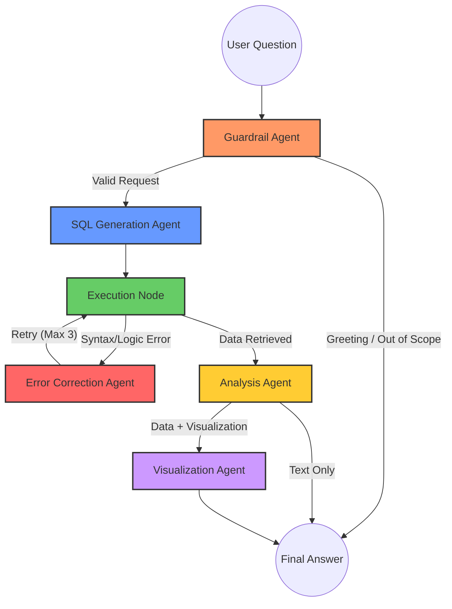

# 🛡️ ZorluKurt Trading: AI Analytics Architecture

This document describes the multi-agent orchestration logic used to convert natural language into secure, role-filtered e-commerce insights.

## 📊 Agent Communication Graph

The system uses **LangGraph** to manage the state and transitions between specialized AI agents.

---

## 🧩 Agent Roles & Responsibilities

### 1. Guardrail Agent (The Security Layer)
- **Sanitization**: Strips prompt injections and identity claims.
- **Role-Based Access (RBAC)**: Validates if the user (ADMIN, CORPORATE, or INDIVIDUAL) has permission to see the requested data.
- **Language Detection**: Automatically detects Turkish or English to maintain consistent localization.

### 2. SQL Generation Agent (The Data Architect)
- **Think-then-Code**: Analyzes the database schema and sample values.
- **RBAC Enforcement**: Injects mandatory filters (e.g., `WHERE store_id = X`) into the query to ensure data isolation.
- **Statistical Accuracy**: Uses advanced PostgreSQL functions for medians, trends, and standard deviations.

### 3. Execution Node & Error Agent (The Reliability Layer)
- **Strict Read-Only**: Runs queries in a `SELECT` only environment with a connection pool.
- **Self-Healing**: If a query fails, the Error Agent analyzes the PostgreSQL error message and the schema to provide a corrected version instantly.

### 4. Analysis Agent (The Insight Engine)
- **Data Interpretation**: Converts raw JSON results into human-readable natural language.
- **Decision Making**: Determines if the data is complex enough to require a visual chart.

### 5. Visualization Agent (The Designer)
- **Interactive Charts**: Generates executable Plotly code.
- **Dynamic Rendering**: Produces JSON data that the frontend renders as interactive, hoverable charts.

---

## 🔐 Multi-Layer Security Protocol

| Layer | Method | Security Outcome |
| :--- | :--- | :--- |
| **Authentication** | JWT (Base64 Secret) | Only verified users can access the API. |
| **Logic** | Guardrail Node | Blocks unauthorized or out-of-scope requests. |
| **Database** | Session Read-Only | Hard-blocks `INSERT/UPDATE/DELETE` even if the AI tries. |
| **RBAC** | Mandatory Filtering | Users can never "escape" their own store's data scope. |
